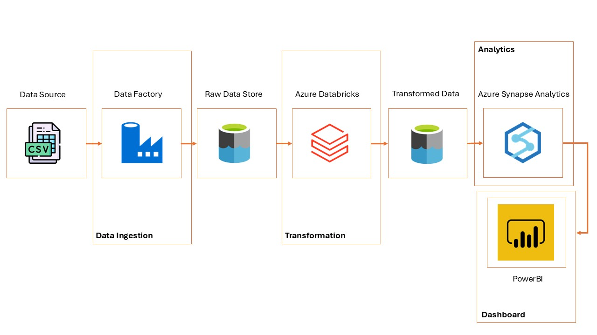

# Tokyo Olympics in Data 🎌

## Project Overview
This project aims to build a cloud-based data pipeline using Azure services to analyze and visualize the 2021 Tokyo Olympics dataset. The pipeline integrates data ingestion, transformation, and visualization to unlock insights into athlete demographics, country performance, and event participation.

## Project Goals
- **Data Ingestion**: Automate the secure extraction of data from a GitHub-hosted CSV file into Azure.
- **Data Storage**: Use Azure Data Lake Storage Gen2 for scalable and secure storage.
- **Data Transformation**: Process and cleanse data using Azure Databricks.
- **Data Analysis**: Leverage Azure Synapse Analytics for SQL-based insights.
- **Visualization**: Build interactive dashboards in Power BI to present insights.

## Tools and Services
The project uses the following Azure services:
1. **Azure Data Factory**: Orchestrates and automates data ingestion.
2. **Azure Data Lake Storage Gen2**: Stores raw and processed data securely.
3. **Azure Databricks**: Handles data cleaning, transformation, and engineering tasks.
4. **Azure Synapse Analytics**: Enables SQL-based querying and advanced analytics.
5. **Power BI**: Creates dashboards for interactive data visualization.

## Architecture
### Workflow Steps:
1. **Data Source**: GitHub-hosted CSV file of the Tokyo Olympics dataset.
2. **Data Ingestion (Azure Data Factory)**: Extracts and validates raw data, storing it in Azure Data Lake Gen2.
3. **Raw Data Storage**: Organized in Azure Data Lake Gen2 under folders (e.g., `raw_data`).
4. **Data Transformation (Azure Databricks)**: Cleans and processes data, storing results back in `transformed_data` folders.
5. **Analytics (Azure Synapse Analytics)**: Performs in-depth analysis using SQL queries.
6. **Visualization (Power BI)**: Creates dashboards to display trends, comparisons, and performance metrics.

### Architecture Diagram

## Project Video
🎥 [Watch the project walkthrough on YouTube](https://www.youtube.com/watch?v=MUiJub80OHM)

## Implementation
### 1. Data Ingestion
- Tool: Azure Data Factory
- Activity: Configured `Copy Data` to securely pull data from GitHub via HTTP.

### 2. Data Storage
- Tool: Azure Data Lake Storage Gen2
- Organized storage using hierarchical namespaces.

### 3. Data Transformation
- Tool: Azure Databricks
- Performed cleaning, enrichment, and aggregations using Spark.

### 4. Data Analysis
- Tool: Azure Synapse Analytics
- Created tables and executed SQL-based queries.

### 5. Visualization
- Tool: Power BI
- Connected directly to Synapse to build interactive dashboards.

## Dataset
- **Source**: [Kaggle - 2021 Tokyo Olympics Dataset](https://www.kaggle.com/datasets/arjunprasadsarkhel/2021-olympics-in-tokyo)

## References
- [Azure Data Factory Documentation](https://docs.microsoft.com/azure/data-factory)
- [Azure Data Lake Storage Gen2 Documentation](https://docs.microsoft.com/azure/storage/blobs/data-lake-storage-introduction)
- [Azure Databricks Documentation](https://docs.microsoft.com/azure/databricks)
- [Azure Synapse Analytics Documentation](https://docs.microsoft.com/azure/synapse-analytics)
- [Power BI Documentation](https://learn.microsoft.com/en-us/power-bi/fundamentals/power-bi-service-overview)

---

## Authors
- **Shashank Guda**  
  [LinkedIn](https://linkedin.com/shashankguda) | [Personal Website](https://shashankguda.me)

---

**Made with 💙 by [Shashank Guda](https://shashankguda.me)**
